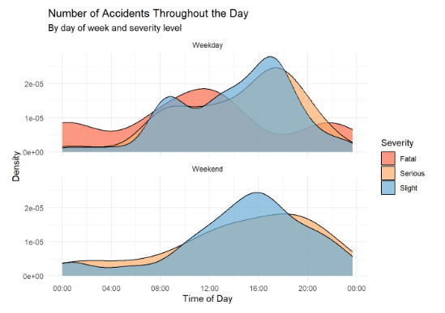
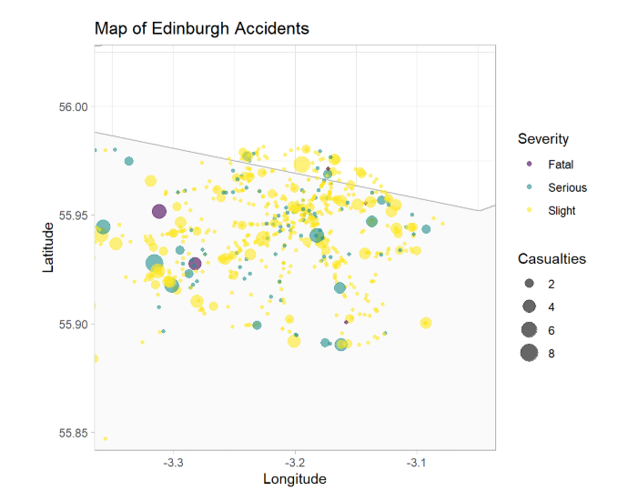
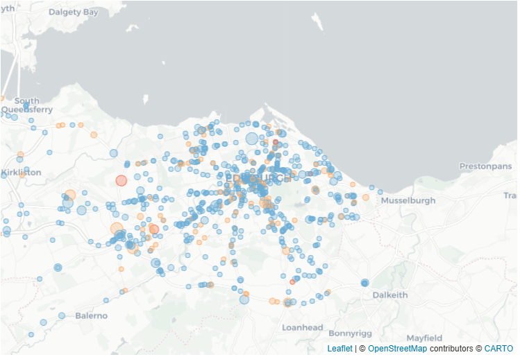
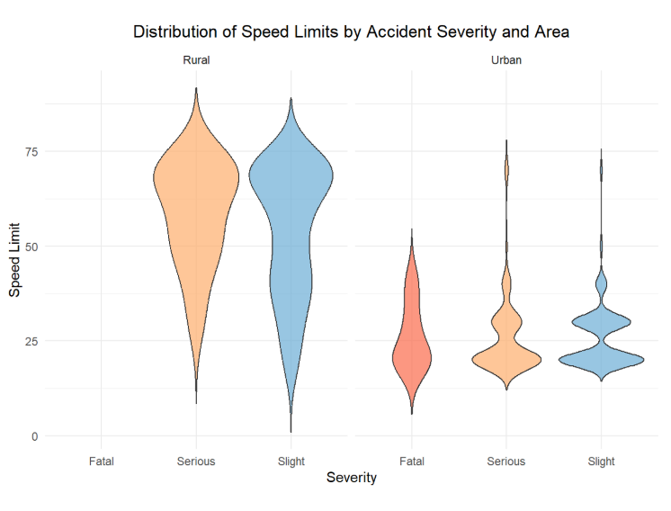
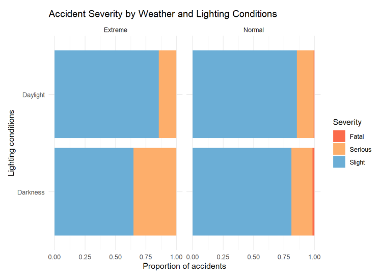
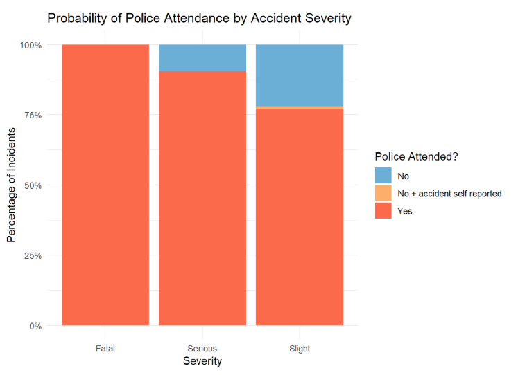

# Investigating Road Traffic Accidents in Edinburgh

A comprehensive, data-driven exploratory data analysis (EDA) of road traffic incidents, focused on uncovering spatial-temporal accident hotspots, assessing environmental risk factors, and analyzing emergency response patterns.

---

## 📌 Project Overview

This project investigates an authentic road accident dataset from Edinburgh to uncover critical patterns that explain traffic risk and crash severity across the urban landscape. 

Utilizing a comprehensive database containing detailed incident records and 31 variables, our team performed an end-to-end analytical workflow combining data cleansing, rigorous statistical profiling, and advanced spatial-temporal visual storytelling. 

The primary goal of this study is to move beyond raw statistics to extract actionable insights on how infrastructure design, speed limits, atmospheric conditions, and lighting interact to compound road risk. The final report is compiled as a fully reproducible, self-contained Quarto document.

---

## 📊 Visual Insights & Analytics

### 1. Temporal Risk Analysis: Weekdays vs. Weekends
The timing and severity of traffic incidents shift drastically throughout the 24-hour cycle. Weekday incidents show sharp, pronounced spikes aligning with morning and evening commuting rush hours, whereas weekend crashes follow a broader distribution centered around the afternoon.



### 2. Spatial Mapping & Hotspot Detection
Geospatial analysis confirms significant urban clustering rather than a random citywide spread. Lower-severity incidents dominate the dense central grid, while higher-casualty crashes are scattered along arterial routes.



### 3. Interactive Geospatial Dashboard
An interactive map component allows stakeholder deep-dives into localized accident zones, where marker radius corresponds dynamically to casualty counts and colors represent specific crash severities.



### 4. Structural Distribution of Speed Limits
Analysis of infrastructure parameters highlights that the vast majority of urban incidents are heavily concentrated on low-speed roads (20–30 mph) due to frequent conflict points and pedestrian density.



### 5. Accident Severity & Emergency Response Profiles
Evaluating environmental variables reveals that lighting conditions amplify crash severity more strongly than adverse weather like rain or fog alone. Concurrently, operational data shows a highly integrated emergency workflow, with police attendance remaining consistently high across all severity levels.

<p>
  
  
</p>

---

## 💡 Key Insights & Conclusions

* **Temporal Commuter Risks:** Weekday traffic risk peaks heavily during specific rush-hour windows, demanding targeted law enforcement and traffic management during commuting hours.
* **Lighting as a Risk Multiplier:** Adverse weather conditions are hazardous, but poor or absent street lighting acts as a much stronger catalyst for increasing crash severity.
* **Speed vs. Severity:** Urban accidents dominate low-speed zones due to sheer traffic volume and complex intersections, but rural accidents at 60–70 mph demonstrate exponentially higher rates of serious and fatal outcomes.
* **Integrated Emergency Workflows:** High police attendance metrics across all severities indicate a robust, deeply integrated emergency response infrastructure already in place.

---

## 👥 Team & Contributors

We are a collaborative team of data enthusiasts focused on delivering impactful data stories:

* **Artur Zavistovskii** — [GitHub Profile](https://github.com/artyz1200-hub)
* **Bhuvanesh Dinesh Wadhwani** — [GitHub Profile](https://github.com/BhuvaneshWadhwani)
* **Anastasiia Khitrova** — [GitHub Profile](https://github.com/hitrova27-svg)

---

## 🛠️ Installation & Reproduction

### Required R Packages
To run the analysis locally, ensure you have the following libraries installed in your R environment:
* `tidyverse` (Data manipulation & static plotting)
* `psych` (Statistical profiling)
* `hms` & `scales` (Temporal scaling)
* `viridis` (Accessible color scales)
* `maps` & `leaflet` (Geospatial mapping)

### Setup and Render

1. Clone the repository and install the dependencies inside your R console:
```r
   install.packages(c("tidyverse", "psych", "hms", "viridis", "maps", "leaflet", "scales"))

```

2. Verify that the dataset file is placed exactly at `data/accidents.csv`.
3. Render the interactive Quarto HTML report via your terminal:

```bash
   quarto render index.qmd

```

4. If you prefer an active development server, initiate the live preview:

```bash
   quarto preview index.qmd --no-browser
```
